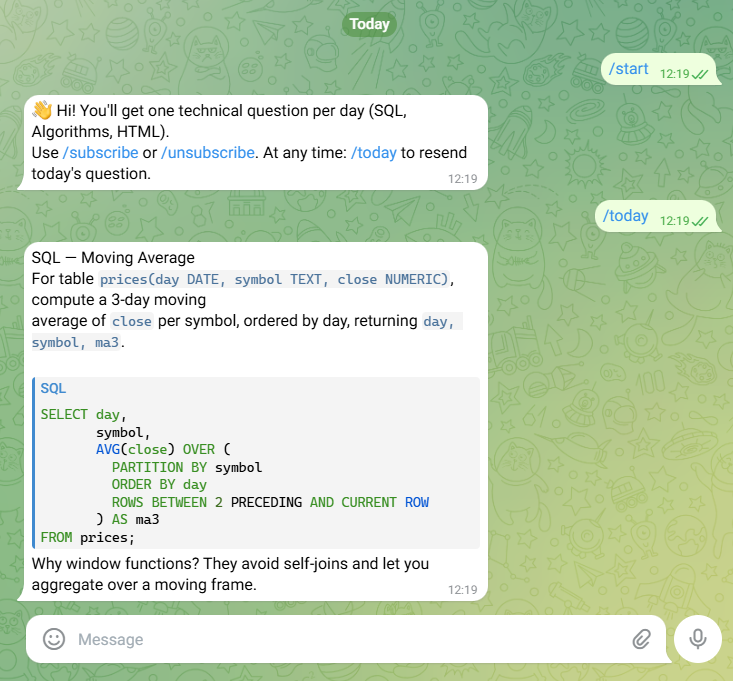

# Daily Tech Q Bot 🤖

Telegram bot that sends **one technical question per day**  
(SQL, Algorithms, HTML) with explained solutions.

## ✨ Features
- Daily question at 09:00 (configurable)
- Categories: SQL, Algorithms, HTML
- Inline buttons: Show solution, Another question, Resources
- User subscription management (subscribe/unsubscribe)

##  Example
Here’s how it looks in Telegram:



##  Setup
1. Clone the repo:
   ```bash
   git clone https://github.com/<your-username>/daily-tech-bot.git
   cd daily-tech-bot
2. Create a virtual environment and install dependencies
   ```bash
   python -m venv .venv
   .venv\Scripts\activate   # Windows
   pip install -r requirements.txt
   
3. Create a .env file
   ```bash
   TELEGRAM_TOKEN=PUT_YOUR_TOKEN_HERE
   TZ=Asia/Jerusalem
   SCHEDULE_HOUR=9
   SCHEDULE_MIN=0
   
4. Run
   ```bash
   python bot.py
